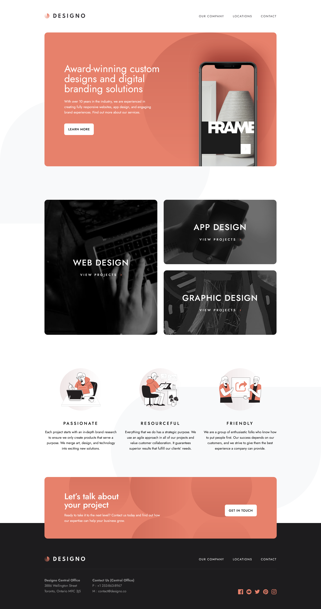

# Frontend Mentor - Designo agency website

# Frontend Mentor - Designo agency website solution

This is a solution to the [Designo agency website challenge on Frontend Mentor](https://www.frontendmentor.io/challenges/designo-multipage-website-G48K6rfUT). Frontend Mentor challenges help you improve your coding skills by building realistic projects. 

## Table of contents

- [Overview](#overview)
  - [The challenge](#the-challenge)
  - [Screenshot](#screenshot)
  - [Links](#links)
- [My process](#my-process)
  - [Built with](#built-with)
- [Author](#author)

## Overview

### The challenge

Users should be able to:

- View the optimal layout for each page depending on their device's screen size
- See hover states for all interactive elements throughout the site
- Receive an error message when the contact form is submitted if:
  - The `Name`, `Email Address` or `Your Message` fields are empty should show "Can't be empty"
  - The `Email Address` is not formatted correctly should show "Please use a valid email address"
- **Bonus**: View actual locations on the locations page maps

### Screenshot

### Links

- Solution URL: [Link](https://www.frontendmentor.io/solutions/designo-multi-page-website-built-with-angular-sass-vpI_BbIj6Z)
- Live Site URL: [Link](https://designo-website-jet.vercel.app/home)

## My process

### Built with

- Angular
- Angular Material
- Typescript
- SASS
- NgxMask
- Mobile-first workflow

## Author

- Website - [@danielmrz-dev](https://danielmrz-portfolio.vercel.app/)
- Frontend Mentor - [@danielmrz-dev](https://www.frontendmentor.io/profile/danielmrz-dev)
- Twitter - [@danielmrz_dev](https://www.twitter.com/@danielmrz_dev)